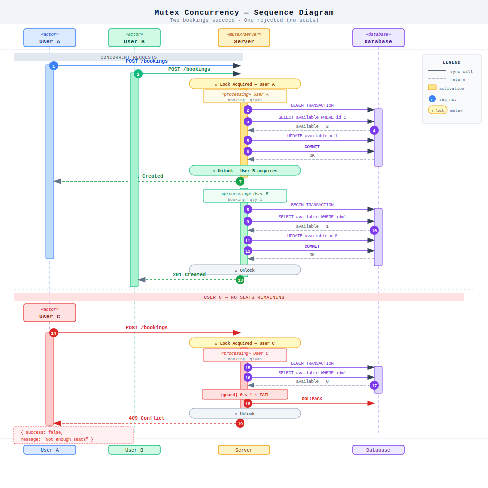
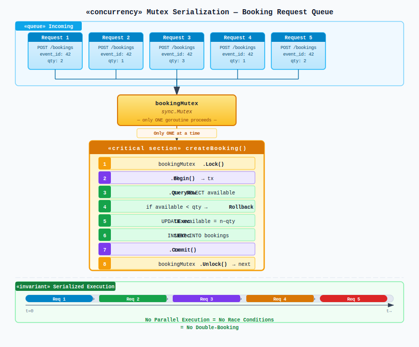
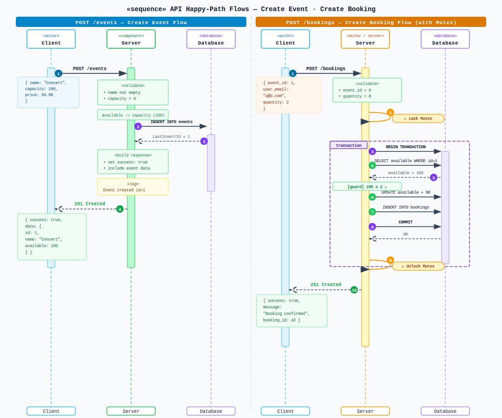
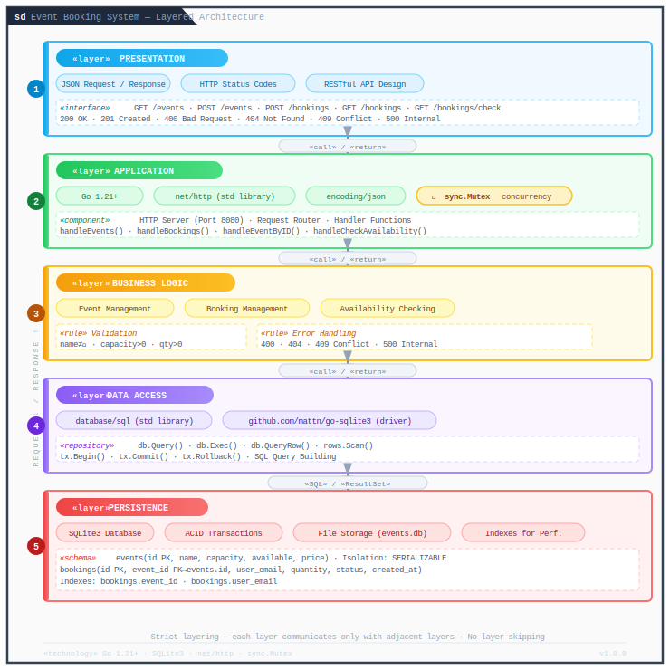
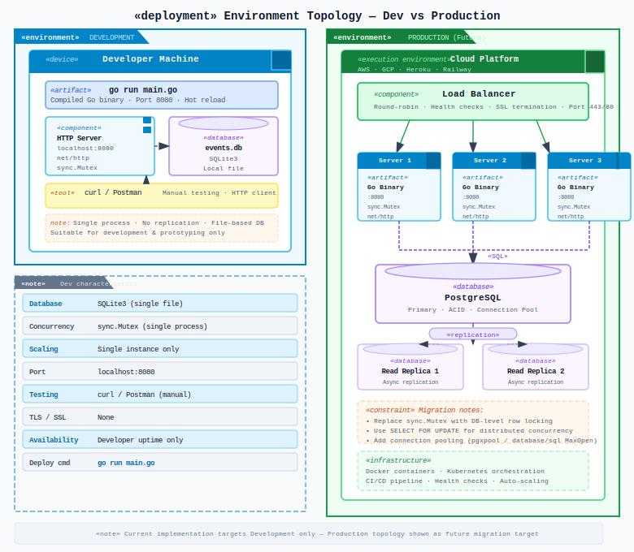

# System Architecture Diagram

## High-Level Architecture

## Request Flow Diagram

### Normal Booking Flow (Success)

### Concurrent Booking Flow (Race Condition Prevented)

## Component Interaction Diagram

## Concurrency Control Mechanism

## Data Flow Diagram

## Technology Stack Layers

## Deployment Architecture

## Error Handling Flow

